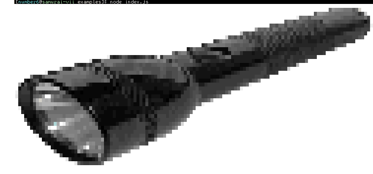

# img-to-pixmap

Dump raw RGBA pixel data from images using
[GraphicsMagick](http://www.graphicsmagick.org/)'s
[Magick++](http://www.graphicsmagick.org/Magick++/).

> When I originally wrote this,
> [node-imagemagick-native](https://github.com/mash/node-imagemagick-native)
> didn't expose `getConstPixels`. This code was cobbled together from there to
> scratch an itch. It provides an interesting case study for building a native
> Node module.

## Usage

    var imgToPixmap = require('img-to-pixmap');
    imgToPixmap({ src: './small-square.jpg' });
    // { height: 2, width: 2, data: <Buffer 00 00 00 ff ... > }

## Example

The included example dumps the pixel data from a [sample
image](https://commons.wikimedia.org/wiki/Template:Potd/2005-03#mediaviewer/File:Flashlight.jpg)
and prints an approximation to the terminal.

    cd examples
    node index.js

## API

### imgToPixmap( options )

Convert an image provided to `options.src` as a path to file or Buffer.

The `options` argument can have following values:

    {
      srcData : required. string file path or Buffer with binary image data
      format  : optional. one of http://www.imagemagick.org/script/formats.php ex: "JPEG"
      debug   : optional. 1 or 0
    }

The method returns an object similar to:

    {
      width  : 3904,
      height : 2622,
      data   : <Buffer 00 00 fe ff 00 ...>
    }

Pixel data is a Buffer packed with quartets of 8-bit RGBA data.

## Installation

### Linux / Mac

Install [Graphicsmagick](http://www.graphicsmagick.org/) with headers before
installing this module.

Tested with GraphicsMagick 1.3.18 on ArchLinux.

    sudo pacman -S graphicsmagick

      or

    brew install imagemagick --build-from-source

      or

    sudo yum install ImageMagick-c++ ImageMagick-c++-devel

      or

    sudo apt-get install libmagick++-dev

Make sure you can find Magick++-config in your PATH.  Then:

    git clone https://github.com/dirtyrottenscoundrel/img-to-pixmap
    cd img-to-pixmap
    npm install

If you are on ArchLinux, you will likely need to pass the --python=python2 flag
to node-gyp since Arch now defaults to Python3.

## Todo

- Remove 8-bit restriction
- Add ability to use as stream
